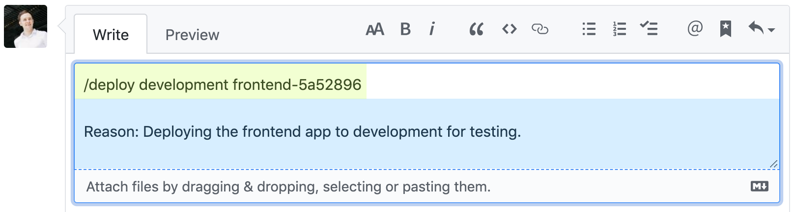

# Slash Command Dispatch
[](https://github.com/peter-evans/slash-command-dispatch/actions?query=workflow%3ACI)
[](https://github.com/marketplace/actions/slash-command-dispatch)

A GitHub action that facilitates ["ChatOps"](https://www.pagerduty.com/blog/what-is-chatops/) by creating dispatch events for slash commands.

### How does it work?

The action runs in `issue_comment` event workflows and checks the first line of comments for slash commands.
When a valid command is found it creates a [repository dispatch](https://docs.github.com/en/actions/reference/events-that-trigger-workflows#repository_dispatch) event that includes a payload containing full details of the command and its context.
It also supports creating [workflow dispatch](https://docs.github.com/en/actions/reference/events-that-trigger-workflows#workflow_dispatch) events with defined input parameters.

### Why create dispatch events?

"ChatOps" with slash commands can work in a basic way by parsing the commands during `issue_comment` events and immediately processing the command.
In repositories with a lot of activity, the workflow queue will get backed up very quickly trying to handle new `issue_comment` events *and* process the commands themselves.

Dispatching commands to be processed elsewhere keeps the workflow queue moving quickly. It essentially enables parallel processing of workflows.

An additional benefit of dispatching is that it allows non-sensitive workloads to be run in public repositories to save using private repository GitHub Action minutes.

<div align="center"></div>

## Demos

See it in action with the following live demos.

- [ChatOps Demo in Issues](https://github.com/peter-evans/slash-command-dispatch/issues/3)
- [ChatOps Demo in Pull Requests](https://github.com/peter-evans/slash-command-dispatch/pull/8)
- [Slash command code formatting - Python](https://github.com/peter-evans/slash-command-dispatch/pull/28)

## Documentation

- [Getting started](docs/getting-started.md)
- [Examples](docs/examples.md)
- [Standard configuration](#standard-configuration)
- [Advanced configuration](docs/advanced-configuration.md)
- [Workflow dispatch](docs/workflow-dispatch.md)
- [Updating to v4](docs/updating.md)

## Dispatching commands

### Standard configuration

The following workflow should be configured in the repository where commands will be dispatched from. This example will respond to comments containing the slash commands `/deploy`, `/integration-test` and `/build-docs`.

```yml
name: Slash Command Dispatch
on:
  issue_comment:
    types: [created]
jobs:
  slashCommandDispatch:
    runs-on: ubuntu-latest
    steps:
      - name: Slash Command Dispatch
        uses: peter-evans/slash-command-dispatch@v4
        with:
          token: ${{ secrets.PAT }}
          commands: |
            deploy
            integration-test
            build-docs
```

Note that not specifying the `repository` input will mean that dispatch events are created in the *current* repository by default. It's perfectly fine to use the current repository and not dispatch events to a separate "processor" repository.

This action also features [advanced configuration](docs/advanced-configuration.md) that allows each command to be configured individually if necessary. Use the standard configuration shown above unless you require advanced features.

### Action inputs

| Input | Description | Default |
| --- | --- | --- |
| `token` | (**required**) A `repo` scoped [Personal Access Token (PAT)](https://docs.github.com/en/github/authenticating-to-github/creating-a-personal-access-token). Note: `GITHUB_TOKEN` *does not* work here. See [token](#token) for further details. | |
| `reaction-token` | `GITHUB_TOKEN` or a `repo` scoped [Personal Access Token (PAT)](https://docs.github.com/en/github/authenticating-to-github/creating-a-personal-access-token). See [reaction-token](#reaction-token) for further details. | `GITHUB_TOKEN` |
| `reactions` | Add reactions. :eyes: = seen, :rocket: = dispatched | `true` |
| `commands` | (**required**) A comma or newline separated list of commands. | |
| `permission` | The repository permission level required by the user to dispatch commands. See [permission](#permission) for further details. (`none`, `read`, `triage`, `write`, `maintain`, `admin`) | `write` |
| `issue-type` | The issue type required for commands. (`issue`, `pull-request`, `both`) | `both` |
| `allow-edits` | Allow edited comments to trigger command dispatches. | `false` |
| `repository` | The full name of the repository to send the dispatch events. | Current repository |
| `event-type-suffix` | The repository dispatch event type suffix for the commands. | `-command` |
| `static-args` | A comma or newline separated list of arguments that will be dispatched with every command. | |
| `dispatch-type` | The dispatch type; `repository` or `workflow`. See [dispatch-type](#dispatch-type) for further details. | `repository` |
| `config` | | JSON configuration for commands. See [Advanced configuration](docs/advanced-configuration.md) | |
| `config-from-file` | | JSON configuration from a file for commands. See [Advanced configuration](docs/advanced-configuration.md) | |

#### `token`

This action creates [repository_dispatch](https://docs.github.com/en/actions/reference/events-that-trigger-workflows#repository_dispatch) and [workflow_dispatch](https://docs.github.com/en/actions/reference/events-that-trigger-workflows#workflow_dispatch) events.
The default `GITHUB_TOKEN` does not have scopes to create these events, so a `repo` scoped [PAT](https://docs.github.com/en/github/authenticating-to-github/creating-a-personal-access-token) is required.
If you will be dispatching commands to public repositories *only* then you can use the more limited `public_repo` scope.

When using the action in a GitHub organization, the user the PAT is created on must be a member of the organization.
Additionally, the PAT should be given the `org:read` scope.

#### `reaction-token`

If you don't specify a token for `reaction-token` it will use the default `GITHUB_TOKEN`.
Reactions to comments will then be made by the @github-actions bot user.
You can use a [PAT](https://docs.github.com/en/github/authenticating-to-github/creating-a-personal-access-token) if you would prefer reactions to be made by the user account associated with the PAT. 

```yml
      - name: Slash Command Dispatch
        uses: peter-evans/slash-command-dispatch@v4
        with:
          token: ${{ secrets.PAT }}
          reaction-token: ${{ secrets.PAT }}
          commands: |
            deploy
            integration-test
            build-docs
```

#### `permission`

This input sets the repository permission level required by the user to dispatch commands.
It expects one of the [five repository permission levels](https://docs.github.com/en/github/setting-up-and-managing-organizations-and-teams/repository-permission-levels-for-an-organization#permission-levels-for-repositories-owned-by-an-organization), or `none`.
From the least to greatest permission level they are `none`, `read`, `triage`, `write`, `maintain` and `admin`.

Setting `write` as the required permission level means that any user with `write`, `maintain` or `admin` permission level will be able to execute commands.

Note that `read`, `triage` and `maintain` are only applicable to organization repositories.
For repositories owned by a user account there are only two permission levels, the repository owner (`admin`) and collaborators (`write`).

There is a known issue with permissions when using [nested teams](https://docs.github.com/en/organizations/organizing-members-into-teams/about-teams#nested-teams) in a GitHub organization. See [here](https://github.com/peter-evans/slash-command-dispatch/issues/120) for further details.

#### `dispatch-type`

By default, the action creates [repository_dispatch](https://docs.github.com/en/actions/reference/events-that-trigger-workflows#repository_dispatch) events.
Setting `dispatch-type` to `workflow` will instead create [workflow_dispatch](https://docs.github.com/en/actions/reference/events-that-trigger-workflows#workflow_dispatch) events.
There are significant differences in the action's behaviour when using `workflow` dispatch. See [workflow dispatch](docs/workflow-dispatch.md) for usage details.

For the majority of use cases, the default `repository` dispatch will likely be the most suitable for new workflows.
If you already have `workflow_dispatch` workflows, you can execute them with slash commands using this action.

| Repository Dispatch (default) | Workflow Dispatch |
| --- | --- |
| Events are created with a `client_payload` giving the target workflow access to a wealth of useful [context properties](#accessing-contexts). | A `client_payload` cannot be sent with [workflow_dispatch](https://docs.github.com/en/actions/reference/events-that-trigger-workflows#workflow_dispatch) events. The target workflow can only make use of up to 10 pre-defined inputs, the names of which must match named arguments supplied with the slash command. |
| Slash commands can only execute workflows in the target repository's default branch. | Slash commands can execute workflows in any branch using the `ref` named argument. The reference can be a branch, tag, or a commit SHA. This can be useful to test workflows in PR branches before merging. |
| Immediate command validation feedback is unavailable when creating the dispatch event. | Immediate command [validation feedback](docs/workflow-dispatch.md#validation-errors) is available as an action output. |

### How comments are parsed for slash commands

Slash commands must be placed in the first line of the comment to be interpreted as a command.

- The command must start with a `/`
- The slash command extends to the last non-whitespace character on the first line
- Anything after the first line is ignored and can be freely used for comments



## Handling dispatched commands

The following documentation applies to the `dispatch-type` default, `repository`, which creates [repository_dispatch](https://developer.github.com/v3/repos/#create-a-repository-dispatch-event) events.
For `workflow` dispatch documentation, see [workflow dispatch](docs/workflow-dispatch.md).

### Event types

Repository dispatch events have a `type` to distinguish between events. The `type` set by the action is a combination of the slash command and `event-type-suffix`. The `event-type-suffix` input defaults to `-command`.

For example, if your slash command is `integration-test`, the event type will be `integration-test-command`.

```yml
on:
  repository_dispatch:
    types: [integration-test-command]
```

### Accessing contexts

Commands are dispatched with a payload containing a number of contexts.

#### `slash_command` context

The slash command context contains the command and any arguments that were supplied by the user.
It will also contain any static arguments if configured.

To demonstrate, take the following configuration as an example.
```yml
      - uses: peter-evans/slash-command-dispatch@v4
        with:
          token: ${{ secrets.PAT }}
          commands: |
            deploy
          static-args: |
            production
            region=us-east-1
```

For the above example configuration, the slash command `/deploy branch=main dry-run reason="new feature"` will be converted to a JSON payload as follows.

```json
    "slash_command": {
        "command": "deploy",
        "args": {
            "all": "production region=us-east-1 branch=main dry-run reason=\"new feature\"",
            "unnamed": {
                "all": "production dry-run",
                "arg1": "production",
                "arg2": "dry-run"
            },
            "named": {
                "region": "us-east-1",
                "branch": "main",
                "reason": "new feature"
            },
        }
    }
```

The properties in the `slash_command` context from the above example can be used in a workflow as follows.

```yml
      - name: Output command and arguments
        run: |
          echo ${{ github.event.client_payload.slash_command.command }}
          echo ${{ github.event.client_payload.slash_command.args.all }}
          echo ${{ github.event.client_payload.slash_command.args.unnamed.all }}
          echo ${{ github.event.client_payload.slash_command.args.unnamed.arg1 }}
          echo ${{ github.event.client_payload.slash_command.args.unnamed.arg2 }}
          echo ${{ github.event.client_payload.slash_command.args.named.region }}
          echo ${{ github.event.client_payload.slash_command.args.named.branch }}
          echo ${{ github.event.client_payload.slash_command.args.named.reason }}
          # etc.
```

#### `github` and `pull_request` contexts

The payload contains the `github` context of the `issue_comment` event at path `github.event.client_payload.github`.
Additionally, if the comment was made in a pull request, the action calls the [GitHub API to fetch the pull request detail](https://docs.github.com/en/rest/pulls/pulls#get-a-pull-request) and attaches it to the payload at path `github.event.client_payload.pull_request`.

You can inspect the payload with the following step.
```yml
      - name: Dump the client payload context
        env:
          PAYLOAD_CONTEXT: ${{ toJson(github.event.client_payload) }}
        run: echo "$PAYLOAD_CONTEXT"
```

Note that the `client_payload.github.payload.issue.body` and `client_payload.pull_request.body` context properties will be truncated if they exceed 1000 characters.

### Responding to the comment on command completion

Using [create-or-update-comment](https://github.com/peter-evans/create-or-update-comment) action there are a number of ways you can respond to the comment once the command has completed.

The simplest response is to add a :tada: reaction to the comment.

```yml
      - name: Add reaction
        uses: peter-evans/create-or-update-comment@v4
        with:
          token: ${{ secrets.PAT }}
          repository: ${{ github.event.client_payload.github.payload.repository.full_name }}
          comment-id: ${{ github.event.client_payload.github.payload.comment.id }}
          reactions: hooray
```

Another option is to reply with a new comment containing a link to the run output.

```yml
      - name: Create URL to the run output
        id: vars
        run: echo "run-url=https://github.com/$GITHUB_REPOSITORY/actions/runs/$GITHUB_RUN_ID" >> $GITHUB_OUTPUT

      - name: Create comment
        uses: peter-evans/create-or-update-comment@v4
        with:
          token: ${{ secrets.PAT }}
          repository: ${{ github.event.client_payload.github.payload.repository.full_name }}
          issue-number: ${{ github.event.client_payload.github.payload.issue.number }}
          body: |
            [Command run output][1]

            [1]: ${{ steps.vars.outputs.run-url }}
```

## License

[MIT](LICENSE)
