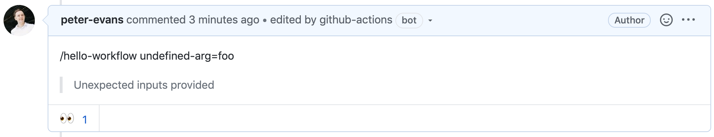

# Workflow dispatch

This documentation applies when the `dispatch-type` input is set to `workflow`, which instructs the action to create [workflow_dispatch](https://docs.github.com/en/actions/reference/events-that-trigger-workflows#workflow_dispatch) events.

To learn about the `workflow_dispatch` event, see GitHub's documentation on [manually running a workflow](https://docs.github.com/en/actions/configuring-and-managing-workflows/configuring-a-workflow#manually-running-a-workflow).

## Action behaviour

There are significant differences in the action's behaviour when using `workflow` dispatch.

- When issuing a slash command with arguments, *only named arguments are accepted*. Unnamed arguments will be ignored.
- A maximum of 10 named arguments are accepted. Additional named arguments after the first 10 will be ignored.
- `ref` is a reserved named argument that does not count towards the maximum of 10. This is used to specify the target reference of the command. The reference can be a branch, tag, or a commit SHA. If you omit the `ref` argument, the target repository's default branch will be used.
- A `client_payload` context cannot be sent with [workflow_dispatch](https://docs.github.com/en/actions/reference/events-that-trigger-workflows#workflow_dispatch) events. The target workflow can only make use of up to 10 pre-defined inputs, the names of which must match named arguments supplied with the slash command.

## Handling dispatched commands

### Workflow name

It is important to name the `workflow_dispatch` event workflow correctly since the action targets the workflow based on its filename.
The target filename is a combination of the command name and the `event-type-suffix`.
Additionally, the file extension must be `.yml`.

For the following example configuration, the target workflows are:
- `deploy-command.yml`
- `integration-test-command.yml`
- `build-docs-command.yml`

```yml
name: Slash Command Dispatch
on:
  issue_comment:
    types: [created]
jobs:
  slashCommandDispatch:
    runs-on: ubuntu-latest
    steps:
      - name: Slash Command Dispatch
        uses: peter-evans/slash-command-dispatch@v4
        with:
          token: ${{ secrets.PAT }}
          commands: |
            deploy
            integration-test
            build-docs
          dispatch-type: workflow
```

### Responding to the comment on command completion

In order to respond to the comment where the slash command was made we need to pass the `comment-id` and `repository` (if the target workflow is not in the current repository). Set static arguments as follows. Note that these static arguments will count towards the maximum of 10 named arguments.

Using basic configuration:
```yml
          static-args: |
            repository=${{ github.repository }}
            comment-id=${{ github.event.comment.id }}
```

Using advanced configuration:
```json
          "static_args": [
            "repository=${{ github.repository }}",
            "comment-id=${{ github.event.comment.id }}"
          ]
```

The target workflow must define these arguments as inputs.

```yml
on:
  workflow_dispatch:
    inputs:
      repository:
        description: 'The repository from which the slash command was dispatched'
        required: true
      comment-id:
        description: 'The comment-id of the slash command'
        required: true
```

Using [create-or-update-comment](https://github.com/peter-evans/create-or-update-comment) action there are a number of ways you can respond to the comment once the command has completed.

The simplest response is to add a :tada: reaction to the comment.

```yml
      - name: Add reaction
        uses: peter-evans/create-or-update-comment@v4
        with:
          token: ${{ secrets.PAT }}
          repository: ${{ github.event.inputs.repository }}
          comment-id: ${{ github.event.inputs.comment-id }}
          reactions: hooray
```

## Validation errors

When creating the [workflow_dispatch](https://docs.github.com/en/actions/reference/events-that-trigger-workflows#workflow_dispatch) event, the GitHub API will return validation errors. In the following cases the action will issue a warning (visible in the Actions log), and set the action output `error-message`.

- `Required input '...' not provided` - A required input for the workflow was not supplied as a named argument.
- `Unexpected inputs provided` - Named arguments were supplied that are not defined as workflow inputs.
- `No ref found for: ...` - The supplied `ref` does not exist in the target repository.
- `Workflow does not have 'workflow_dispatch' trigger` - The target workflow doesn't define `on: workflow_dispatch`, OR, the supplied `ref` doesn't contain the target workflow.

The `error-message` output can be used to provide feedback to the user as follows. Note that the action step needs an `id` to access outputs.

```yml
      - name: Slash Command Dispatch
        id: scd
        uses: peter-evans/slash-command-dispatch@v4
        with:
          token: ${{ secrets.PAT }}
          commands: |
            deploy
            integration-test
            build-docs
          dispatch-type: workflow

      - name: Edit comment with error message
        if: steps.scd.outputs.error-message
        uses: peter-evans/create-or-update-comment@v4
        with:
          comment-id: ${{ github.event.comment.id }}
          body: |
            > ${{ steps.scd.outputs.error-message }}
```


